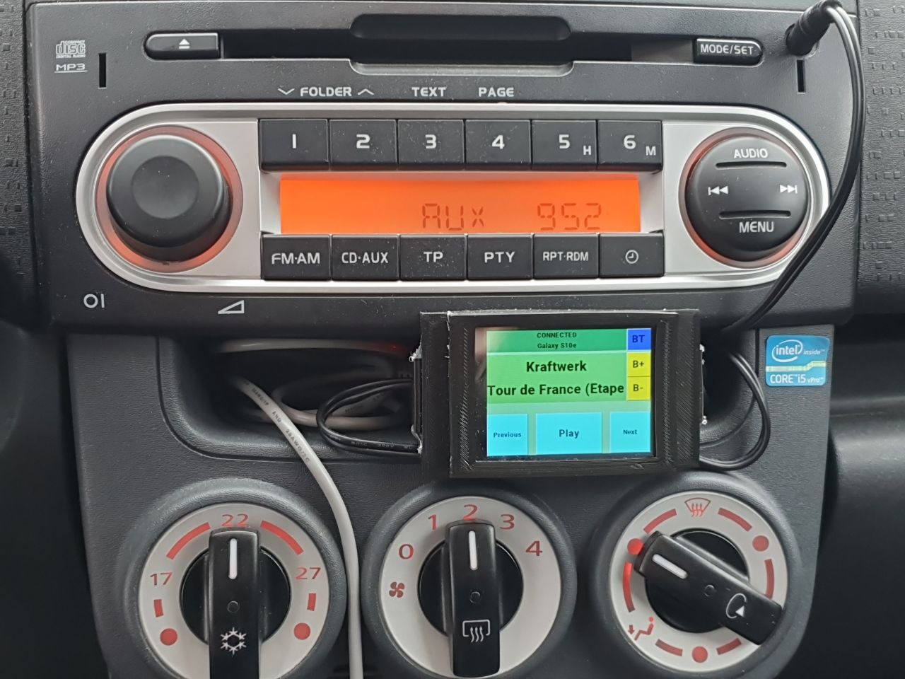

# Kaeppa head unit

Simple bluetooth <-> AUX -bridge for car radios without bluetooth. No modifications to the car required. Powered by usb cable.

Minimal functionalities to keep device simple and fast:
- Bluetooth connection status and connected device name
- Reconnect/find bluetooth devices button
- Artist name and song name
- Next/pause/previous buttons
- Display brightness buttons

## Components used:
- NODEMCU ESP32 module
- [PCM5102 I2S DAC module ](https://it.aliexpress.com/item/32822046058.html?gatewayAdapt=glo2ita)
- [Nextion NX3224F024 3.2" LCD display ](https://nextion.tech/datasheets/nx3224f024/)
- 3D printed enclosure